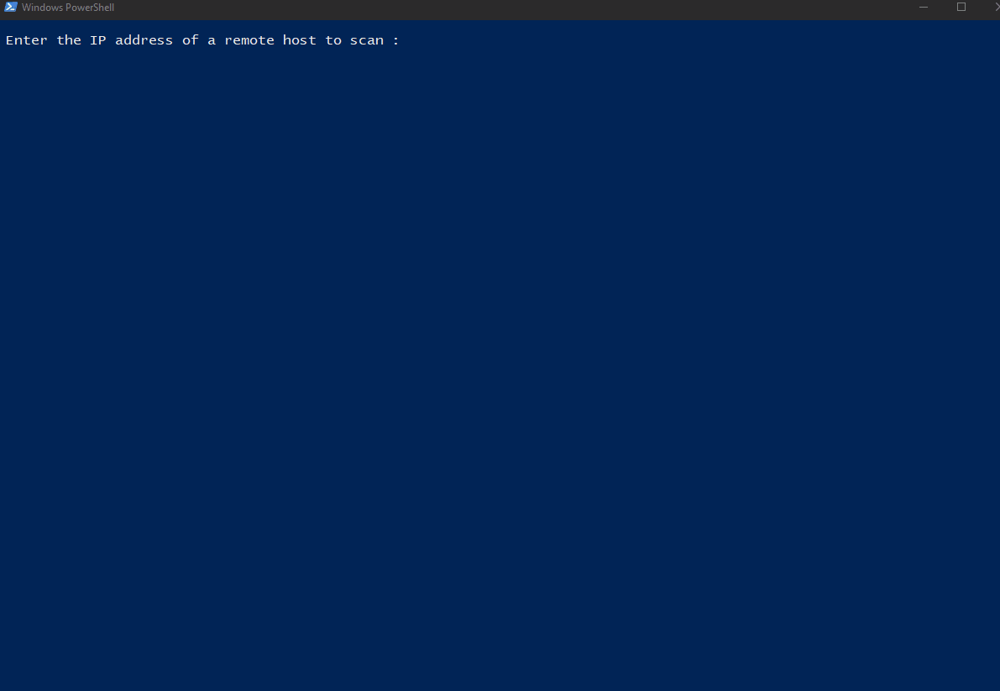

# Port Scanner

## Preview

## How To Run This Program

First, make sure [Python 3](https://www.python.org/downloads/) is installed on your computer.

Then run the program with the following command :

	python PortScanner.py
